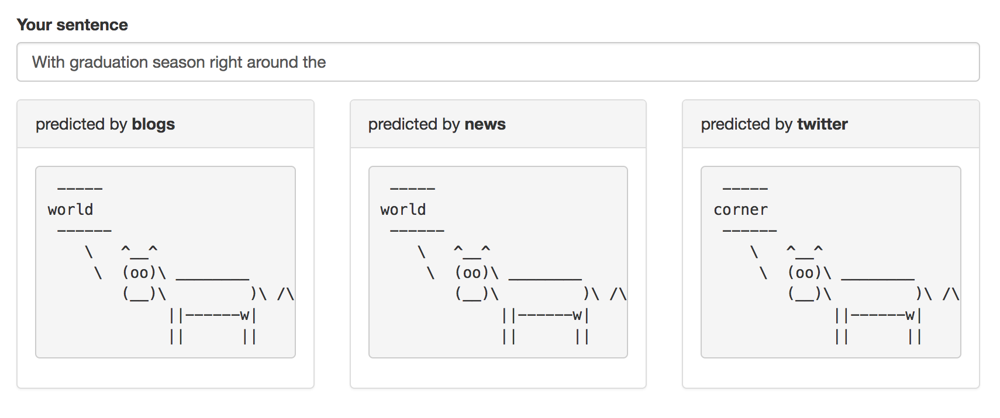

```{r setup, include=FALSE}
knitr::opts_chunk$set(echo = FALSE)
```

## Project objective

The project objective is to predict what the next word might be when we enter an incomplete sentence.

The [Capstone Dataset](https://d396qusza40orc.cloudfront.net/dsscapstone/dataset/Coursera-SwiftKey.zip) is collected from publicly available sources by a web crawler. There are three sources: `blogs`, `news` and `twitter`. Although the dataset contains different languages, we will only use the English part. 

## Corpus Processing and Model Building

The text processing is mainly performed using [tidytext](https://github.com/juliasilge/tidytext) package and each of the three corpus (`blogs`, `news` and `twitter`) was handled independently. The raw text data are lowercased and tokenized into [n-grams](https://en.wikipedia.org/wiki/N-gram). 

To speed up word processing and reduce storage space, we use bigrams and trigrams models here, so the next word can be predicted using the last one or two words of the input sentence. For example, if the last two words of the input is `go to`, and `go to shop` is the most abundant trigram that starts with `go to`, then we will pick `shop` as the next word. As we have noticed, most words appeared in the text are rarely used, so only the words that can be found in at least ten lines of the corpus are considered.

## Shiny Application User Interface

The user interface is straightforward, it contains an input box and three output panels. Different panel corresponds to different source of corpus, here includes `blogs`, `news` and `twitter`.
```{r}

```

## Additional Information

* All the source code are available in the following github repository: <https://github.com/jzsh2000/coursera-data-science-capstone>

* A live demo is running at the `shinyapps.io` site: <https://jzsh2000.shinyapps.io/next-word/>

* About the course, see <https://www.coursera.org/learn/data-science-project>

